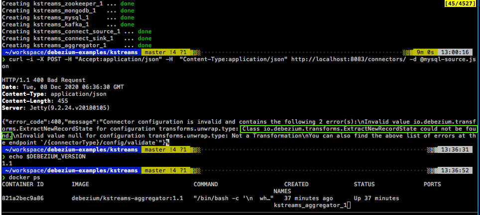

# Debezium KStreams Example

This demo shows how to join two CDC event streams created by Debezium into a single topic and
sink the aggregated change events into MongoDB, using the [Kafka Connect MongoDB sink connector(https://github.com/hpgrahsl/kafka-connect-mongodb).

## Preparations

```shell
# Start Kafka, Kafka Connect, a MySQL and a MongoDB database and the aggregator
export DEBEZIUM_VERSION=1.1
DEBEZIUM_VERSION=1.1 docker-compose up --build

# Start MySQL connector
curl -i -X POST -H "Accept:application/json" -H  "Content-Type:application/json" http://localhost:8083/connectors/ -d @mysql-source-0.9.4.json

# Start MongoDB sink connector
curl -i -X POST -H "Accept:application/json" -H  "Content-Type:application/json" http://localhost:8084/connectors/ -d @mongodb-sink.json
```

# Consume aggregated messages

Browse the Kafka topic:

```shell
docker-compose exec kafka /kafka/bin/kafka-console-consumer.sh \
    --bootstrap-server kafka:9092 \
    --from-beginning \
    --property print.key=true \
    --topic final_ddd_aggregates
```

Examine the target collection in the MongoDB sink database:

```shell
docker-compose exec mongodb bash -c 'mongo inventory'

> db.customers_with_addresses.find().pretty()
```

# Modify records in the source database via MySQL client

```shell
docker-compose exec mysql bash -c 'mysql -u $MYSQL_USER -p$MYSQL_PASSWORD inventory'

mysql> update customers set first_name= "Sarah" where id = 1001;
```

The corresponding aggregate should be updated inMongoDB.

# Shut down the cluster

```shell
docker-compose down
```

# Issues

